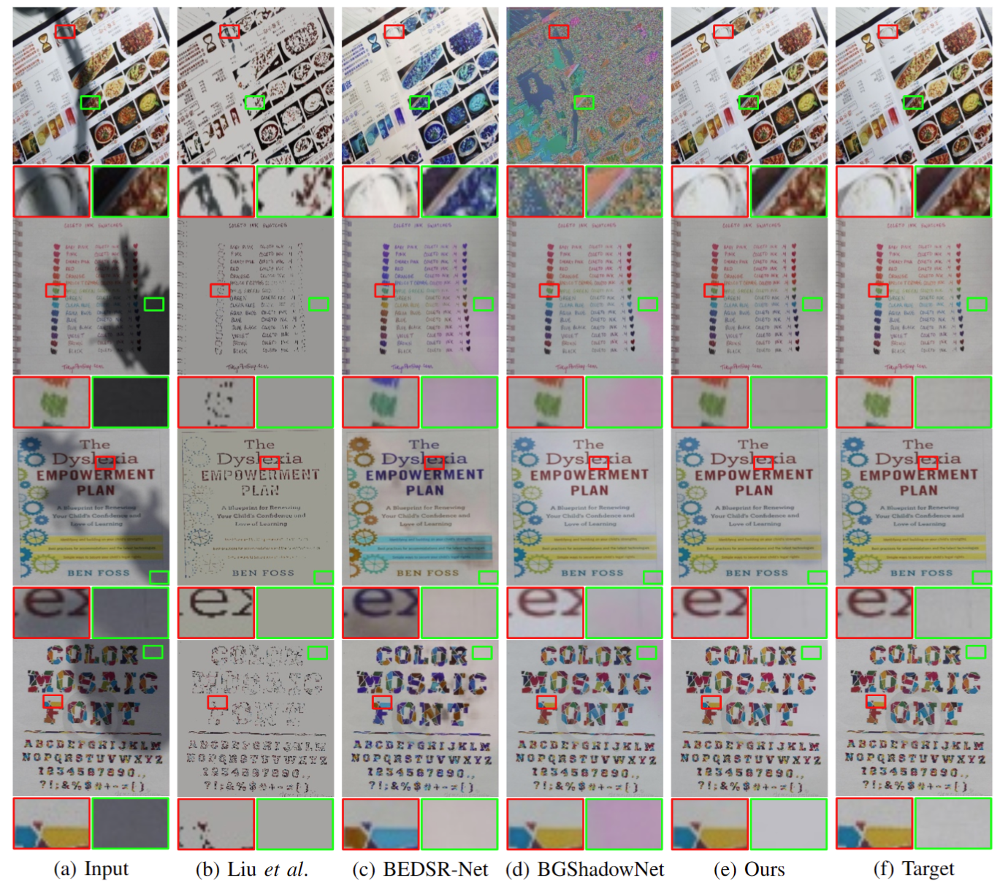

# 📋 ShaDocFormer

<b><a href='https://arxiv.org/abs/2309.06670'>ShaDocFormer: A Shadow-Attentive Threshold Detector With Cascaded Fusion Refiner for Document Shadow Removal.</a> </b>
<div>
<span class="author-block">
  <a href='https://github.com/kilito777'>Weiwen Chen</a><sup> 
</span>,
  <span class="author-block">
    Yingtie Lei</a><sup>
  </span>,
  <span class="author-block">
   <a href='https://shenghongluo.github.io/'> Shenghong Luo</a><sup>
  </span>,
  <span class="author-block">
    Ziyang Zhou</a><sup>
  </span>,
  <span class="author-block">
    Mingxian Li</a><sup>
  </span> and
  <span class="author-block">
    <a href="https://www.cis.um.edu.mo/~cmpun/" target="_blank">Chi-Man Pun</a><sup> 
  </span>
</div>


<b>University of Macau</b>


In <b>_International Joint Conference on Neural Networks 2024 (IJCNN 2024)_<b>


[Paper](https://arxiv.org/abs/2309.06670) 




# ⚙️ Usage
## Installation
```
git clone https://github.com/CXH-Research/DocShadow-SD7K.git
cd DocShadow-SD7K
pip install -r requirements.txt

# 💗 Acknowledgements
This work was supported in part by the Science and Technology Development Fund, Macau SAR, under Grant 0087/2020/A2 and Grant 0141/2023/RIA2.

# 🛎 Citation
If you find our work helpful for your research, please cite:
```bib

```
